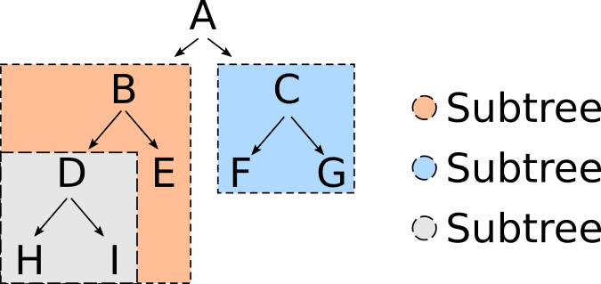
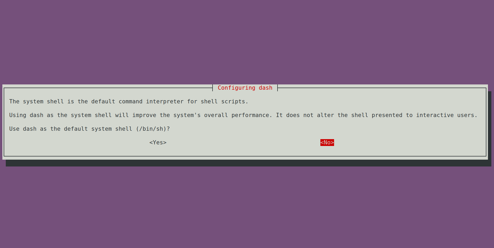

# subtree

- [subtree](#subtree)
  - [개념](#개념)
    - [subtree?](#subtree-1)
  - [실습](#실습)
    - [subtree 추가](#subtree-추가)
    - [subtree 추가 시 고려 사항](#subtree-추가-시-고려-사항)
      - [working tree has modifications. Cannot add.](#working-tree-has-modifications-cannot-add)
    - [subtree 업데이트](#subtree-업데이트)
    - [subtree push](#subtree-push)
    - [subtree push 시 고려 사항](#subtree-push-시-고려-사항)
      - [Maximum function recursion depth (1000) reached](#maximum-function-recursion-depth-1000-reached)
      - [Segmentation fault](#segmentation-fault)
  - [참조](#참조)

## 개념

하나의 저장소를 다른 저장소의 하위 디렉토리로 가져올 수 있다.

### subtree?



[이미지 출처](https://opensource.com/article/20/5/git-submodules-subtrees)

## 실습

실습을 위해 2개의 repository가 필요하다.
명칭은 아무 상관없다.

- xpdojo/git-subtree-a
- xpdojo/git-subtree-b

### subtree 추가

1개의 repository를 subtree로 추가하고, subtree를 업데이트하는 방법을 알아보자.
우선 첫번째 repository를 생성하고 clone한다.

```sh
git clone git@github.com:xpdojo/git-subtree-a.git
```

```sh
cd git-subtree-a
```

subtree로 사용할 `remote`를 추가해야 한다.

```sh
# git remote add <remote_name> <remote_url>
git remote add git-subtree-b git@github.com:xpdojo/git-subtree-b.git
```

```sh
git remote -v
```

```sh
git-subtree-b   git@github.com:xpdojo/git-subtree-b.git (fetch)
git-subtree-b   git@github.com:xpdojo/git-subtree-b.git (push)
origin  git@github.com:xpdojo/git-subtree-a.git (fetch)
origin  git@github.com:xpdojo/git-subtree-a.git (push)
```

`remote`를 기준으로 `subtree`를 추가한다.

```sh
# git subtree add --prefix <subtree_dir_name> <remote_name> <remote_branch>
git subtree add --prefix subtree-b git-subtree-b main
```

```sh
...
Added dir 'subtree-b'
```

sumodule과 달리 `subtree`는 `remote`의 모든 내용을 가져오며 메타데이터가 없다.

```sh
tree .
```

```sh
.
├── README.md
└── subtree-b
    └── README.md

1 directory, 2 files
```

메타데이터는 commit에 기록되어 있다.

```sh
git log
```

```sh
commit 24661efe0596b6dc6d6345d6a567d4c0ff288462 (HEAD -> main)
Merge: e526ad1 6fdfd24
Author: Changsu Im <imcxsu@gmail.com>
Date:   Tue Oct 4 04:29:15 2022 +0900

    Add 'subtree-b/' from commit '6fdfd2429f3a8e639f5d49169bdb7475b3e7a57d'

    git-subtree-dir: subtree-b
    git-subtree-mainline: e526ad13b0db44e458a9b30a6bd6d3c7070e724a
    git-subtree-split: 6fdfd2429f3a8e639f5d49169bdb7475b3e7a57d

commit 6fdfd2429f3a8e639f5d49169bdb7475b3e7a57d (git-subtree-b/main)
Author: markruler <imcxsu@gmail.com>
Date:   Tue Oct 4 00:06:22 2022 +0900

    Initial commit

commit e526ad13b0db44e458a9b30a6bd6d3c7070e724a (origin/main, origin/HEAD)
Author: markruler <imcxsu@gmail.com>
Date:   Tue Oct 4 00:05:00 2022 +0900

    Initial commit
```

### subtree 추가 시 고려 사항

#### working tree has modifications. Cannot add.

```sh
fatal: working tree has modifications.  Cannot add.
```

실제로 변경 사항이 있다면 커밋 후 다시 시도하면 된다.
만약 변경 사항이 없는데도 위와 같은 에러가 발생한다면
upstream을 설정하고 remote와 히스토리가 동일하다는 것을 알려주자.

```sh
git branch --set-upstream-to=upstream/main
```

```sh
git pull
# Already up to date.
```

### subtree 업데이트

`subtree`를 업데이트하려면 remote branch를 `fetch`하고 `merge`해야 한다.

```sh
git fetch git-subtree-b main
```

혹은 `pull`을 사용한다.

```sh
# git subtree pull --prefix=<subtree_dir_name> <remote_name> <remote_branch>
git subtree pull --prefix=subtree-b git-subtree-b main
```

```sh
git log
```

```sh
commit c380b56218de39bcb033235f094cf22bd27dba33 (HEAD -> main)
Merge: cfd14ac c13c9de
Author: Changsu Im <imcxsu@gmail.com>
Date:   Tue Oct 4 04:43:30 2022 +0900

    Merge commit 'c13c9de59551cbad294ea52710b9d7571953248d'

commit cfd14ac9a8f0135a7f172bb677fe1320f7a0608a
Author: Changsu Im <imcxsu@gmail.com>
Date:   Tue Oct 4 04:38:58 2022 +0900

    Update subtree-b

commit c13c9de59551cbad294ea52710b9d7571953248d (git-subtree-b/main)
Author: Changsu Im <imcxsu@gmail.com>
Date:   Tue Oct 4 04:38:58 2022 +0900

    Update subtree-b
```

git-subtree-b 저장소의 경우 별도로 commit 히스토리가 기록되지만,
루트 프로젝트에는 모두 기록된다.

```sh
git log git-subtree-b/main
```

```sh
commit c13c9de59551cbad294ea52710b9d7571953248d (git-subtree-b/main)
Author: Changsu Im <imcxsu@gmail.com>
Date:   Tue Oct 4 04:38:58 2022 +0900

    Update subtree-b
```

### subtree push

우선 root 프로젝트에서 커밋한 후 subtree에 push한다.

```sh
echo -e "${date}" >> subtree-b/README.md
git add -A
git commit -m "Update subtree-b"
```

```sh
# git subtree push --prefix=<subtree_dir_name> <remote_name> <remote_branch>
git subtree push --prefix=subtree-b git-subtree-b main
```

### subtree push 시 고려 사항

#### Maximum function recursion depth (1000) reached

`subtree push` 시 Split을 하는데 recursion이 많이 수행돼서 발생하는 것으로 추측.

```sh
/usr/lib/git-core/git-subtree: 318: Maximum function recursion depth (1000) reached
```

Ubuntu 22.04에서는 아래 명령 후 `<No>`를 선택한다.

```sh
sudo dpkg-reconfigure dash
```



다시 push 해본다.

```sh
# -d 는 debug 옵션
git subtree push --prefix=<dir> <remote_name> <remote_branch> -d
```

```sh
command: {push}
quiet: {}
dir: {<dir>}
opts: {<remote_name> <remote_branch>}

git push using:  <remote_name> <remote_branch>
Splitting <dir>...
Using cachedir: /home/markruler/demo/.git/subtree-cache/270748
Looking for prior splits...
  Main is: '0cb9c5aa6957ffb848631babb7e40f7f767653e7'
    Prior: 0cb9c5aa6957ffb848631babb7e40f7f767653e7 -> ff0546d65d94d13a7c68d809926bbe034fb68d32
progress: 1/5 (0) [0]
Processing commit: 0cb9c5aa6957ffb848631babb7e40f7f767653e7
  prior: ff0546d65d94d13a7c68d809926bbe034fb68d32
progress: 2/5 (0) [0]
Processing commit: fa733dafd152682a3722dec619c4331567e45823
  parents: ea560ec61dfe9c3251653a603936a4c9c9accb8d
    incorrect order: ea560ec61dfe9c3251653a603936a4c9c9accb8d
...
```

위와 같은 recursion 형태의 메시지와 함께 push 되지 않는다.
`Maximum function recursion depth`는 사라졌지만 정상적으로 push가 수행되지 않는다.

그래서 root project에서는 애초에 subtree의 커밋을 알 필요 없도록
`--squash` 옵션을 사용했다.

```sh
git subtree add --prefix=<dir> <remote_name> <remote_branch> --squash
```

그럼 subtree의 커밋 히스토리는 별도로 관리한다.

```sh
commit 46e9d649a301e45710e3e2e76ca1bee0947f1b79
Merge: 77d8792d3 88b551fd5
Author: Changsu Im <imcxsu@gmail.com>
Date:   Tue Dec 27 15:35:35 2022 +0900

    Merge commit '88b551fd596868d0dcb00818ca4b529994e3fa4d' as '<dir>'

commit 88b551fd596868d0dcb00818ca4b529994e3fa4d
Author: Changsu Im <imcxsu@gmail.com>
Date:   Tue Dec 27 15:35:35 2022 +0900

    Squashed '<dir>/' content from commit 1140cfa43

    git-subtree-dir: <dir>
    git-subtree-split: 1140cfa43a106be2d182172b6b5326b7c4ac322c

commit 77d8792d3d00455d661567b8fbdeaf8e8208105e (upstream/main)
Author: Changsu Im <imcxsu@gmail.com>
Date:   Tue Dec 27 14:58:45 2022 +0900

    Initial commit
(END)
```

이후에 subtree directory에 변경 사항을 commit 하고
`subtree push`를 하면 subtree 레포지터리에 정상적으로 push 된다.

#### Segmentation fault

`git subtree split`를 사용하다가 아래와 같은 에러가 발생했다.

```sh
/usr/lib/git-core/git-subtree: line 915: 263295 Done                    eval "$grl"
     263296 Segmentation fault      (core dumped) | while read rev parents; do
    process_split_commit "$rev" "$parents";
done
```

정확한 원인은 알 수 없지만 위 push 에러와 같이 recursion 이슈로 보인다.
`--squash` 옵션을 사용해서 subtree 추가하면 해결된다.

## 참조

- 왜 submodule 대신 subtree를 사용해야 할까?
  - [Git subtree: the alternative to Git submodule](https://www.atlassian.com/git/tutorials/git-subtree) - Atlassian
  - [Why your company shouldn’t use Git submodules](https://codingkilledthecat.wordpress.com/2012/04/28/why-your-company-shouldnt-use-git-submodules/) - Amber
  - [Git subtree를 활용한 코드 공유](https://blog.rhostem.com/posts/2020-01-03-code-sharing-with-git-subtree) - rhostem
